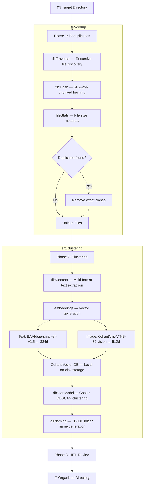

<p align="center">
  <h1 align="center">🌀 Vortiq</h1>
  <p align="center">
    <em>A lightning-fast, zero-cloud CLI utility that cleans your Windows directories by parsing file contents and visual data — automatically destroying clones and generating intelligently named folder structures.</em>
  </p>
  <p align="center">
    
    
    
    
    
    
    
  </p>
</p>

---

## Table of Contents

- [Overview](#overview)
- [Features](#features)
- [Architecture](#architecture)
- [Project Structure](#project-structure)
- [Tech Stack](#tech-stack)
- [Supported File Formats](#supported-file-formats)
- [Prerequisites](#prerequisites)
- [Installation](#installation)
- [Usage](#usage)
- [How It Works](#how-it-works)
- [Configuration](#configuration)
- [Roadmap](#roadmap)
- [Contributing](#contributing)
- [License](#license)

---

## Overview

Vortex uses state-of-the-art embedding models to intelligently group your files. Whether you have text documents, code, PDFs, or images — it semantically analyzes their content **entirely locally**. Your data never leaves your machine.

**The Problem:** Over time, directories accumulate duplicate files and an unstructured mess of documents, images, and code. Manually organizing them is tedious and error-prone.

**The Solution:** Vortex automates the entire process in a single command — deduplicating exact clones via SHA-256, then semantically clustering the remaining files using vector embeddings and DBSCAN, and finally reorganizing them into auto-named folders derived from their content.

---

## Features

### 🔍 Intelligent Deduplication
- **Recursive Directory Traversal** — Walks the entire target directory tree, resolving all nested files.
- **SHA-256 Chunked Hashing** — Identifies exact binary duplicates efficiently, even for very large files, using 4 MB chunked reads.
- **Storage Statistics** — Gathers file size metadata before acting.

### 🧠 Semantic Clustering
- **Multi-Format Content Extraction** — Pulls text from plain text files, code, PDFs (via PyMuPDF), and images (via Tesseract OCR).
- **Local Embedding Generation** — Generates text embeddings with `BAAI/bge-small-en-v1.5` and image embeddings with `Qdrant/clip-ViT-B-32-vision`, all via `fastembed`.
- **Vector Database** — Manages semantic indexes in a local Qdrant instance (on-disk, no server needed).
- **DBSCAN Clustering** — Groups files by semantic proximity using cosine-distance DBSCAN with tuned `eps` and `min_samples` per modality.
- **TF-IDF Directory Naming** — Automatically generates human-readable folder names by extracting the most relevant terms from each cluster's combined content.

### 🛡️ Human-in-the-Loop (HITL)
> *Implementation in progress.*

An interactive review phase that will let you verify the proposed folder structure and directory names before Vortex commits changes to your filesystem.

---

## Architecture



---

## Project Structure

```
Vortex/
├── main.py                          # CLI entry point (Typer + Rich)
├── pyproject.toml                   # Project metadata & dependencies
├── uv.lock                         # Locked dependency versions
├── .python-version                  # Python 3.12
│
├── src/
│   ├── dedup/                       # Phase 1 — Deduplication
│   │   ├── dirTraversal.py          # Recursive directory walker
│   │   ├── fileHash.py              # SHA-256 chunked file hashing
│   │   └── fileStats.py             # File size statistics
│   │
│   ├── clustering/                  # Phase 2 — Semantic Clustering
│   │   ├── fileContent.py           # Multi-format content extraction
│   │   ├── embeddings.py            # Text & image embedding generation + Qdrant storage
│   │   ├── dbscanModel.py           # DBSCAN clustering with data retrieval from Qdrant
│   │   └── dirNaming.py             # TF-IDF based directory name generation
│   │
│   └── hitl/                        # Phase 3 — Human-in-the-Loop (WIP)
│
└── docs/                            # Documentation (WIP)
```

---

## Tech Stack

| Category | Technology | Purpose |
|---|---|---|
| **Language** | Python ≥ 3.12 | Core runtime |
| **CLI Framework** | [Typer](https://typer.tiangolo.com/) + [Rich](https://rich.readthedocs.io/) | Command-line interface with styled output |
| **Text Embeddings** | [FastEmbed](https://github.com/qdrant/fastembed) (`BAAI/bge-small-en-v1.5`) | 384-dim text vectors |
| **Image Embeddings** | [FastEmbed](https://github.com/qdrant/fastembed) (`Qdrant/clip-ViT-B-32-vision`) | 512-dim image vectors |
| **Vector Database** | [Qdrant](https://qdrant.tech/) (local on-disk mode) | Semantic index storage |
| **Clustering** | [scikit-learn](https://scikit-learn.org/) (DBSCAN) | Density-based grouping |
| **PDF Parsing** | [PyMuPDF](https://pymupdf.readthedocs.io/) | Text extraction from PDFs |
| **OCR** | [Tesseract](https://github.com/tesseract-ocr/tesseract) + [pytesseract](https://github.com/madmaze/pytesseract) | Image-to-text extraction |
| **Image Processing** | [Pillow](https://pillow.readthedocs.io/) | Image loading for OCR |
| **TF-IDF** | [scikit-learn](https://scikit-learn.org/) (TfidfVectorizer) | Directory name generation |
| **Package Manager** | [uv](https://docs.astral.sh/uv/) | Fast dependency management |

---

## Supported File Formats

| Category | Extensions | Extraction Method |
|---|---|---|
| **Plain Text / Code** | `.txt`, `.md`, `.csv`, `.json`, `.py`, `.js`, `.html` | Direct UTF-8 read |
| **Documents** | `.pdf` | PyMuPDF text extraction |
| **Images** | `.png`, `.jpg`, `.jpeg` | CLIP embeddings (visual) + Tesseract OCR (textual) |

> **Note:** Images are embedded using CLIP for visual similarity clustering. OCR is used separately when text content is needed (e.g., for directory naming).

---

## Prerequisites

1. **Python 3.12+** — [Download](https://www.python.org/downloads/)
2. **uv** (recommended) — [Install](https://docs.astral.sh/uv/getting-started/installation/)
3. **Tesseract OCR** — Required for image text extraction.
   - Download the Windows installer from [UB Mannheim](https://github.com/UB-Mannheim/tesseract/wiki).
   - Ensure `tesseract.exe` is accessible via your system `PATH`.

---

## Installation

```bash
# Clone the repository
git clone https://github.com/44ompatil/Vortex.git
cd Vortex

# Install dependencies (uv recommended)
uv sync

# Or, using pip
pip install -e .
```

---

## Usage

Vortex exposes a `sort` command that orchestrates the full pipeline:

```bash
# Sort a directory
uv run python main.py sort <target-directory>

# Example
uv run python main.py sort "C:\Users\you\Downloads"
```

### Available Commands

| Command | Description |
|---|---|
| `sort <directory>` | Run the full dedup → cluster → organize pipeline on the target directory |
| `help` | Display available commands and usage information |

### What Happens When You Run `sort`

1. **Scan** — Recursively discovers all files in the target directory.
2. **Dedup** — Identifies and removes exact binary duplicates (SHA-256).
3. **Extract** — Pulls text/visual content from each unique file.
4. **Embed** — Generates vector embeddings (text: 384d, image: 512d).
5. **Cluster** — Groups semantically similar files using DBSCAN.
6. **Name** — Generates descriptive folder names via TF-IDF.
7. **Organize** — Moves files into their newly created, named folders.

---

## How It Works

### Phase 1: Deduplication (`src/dedup/`)

Files are recursively discovered via `os.walk`. Each file is hashed using **SHA-256** with 4 MB chunked reads to handle large files efficiently. Files sharing the same hash are identified as exact duplicates — only one copy is kept, the rest are deleted.

### Phase 2: Semantic Clustering (`src/clustering/`)

Remaining unique files have their content extracted based on file type. Text content is embedded into 384-dimensional vectors using `BAAI/bge-small-en-v1.5`, while images are embedded into 512-dimensional vectors using `Qdrant/clip-ViT-B-32-vision`. All vectors are stored in a local Qdrant database.

**DBSCAN** (Density-Based Spatial Clustering of Applications with Noise) then groups files by semantic similarity using cosine distance. The algorithm parameters are tuned separately for each modality:

| Modality | `eps` | `min_samples` |
|---|---|---|
| Text | 0.25 | 2 |
| Image | 0.50 | 2 |

Note : These are the hyperparameters. They are subject to change. You can update this if the model's not working properly.

Each cluster is assigned a human-readable name generated by running **TF-IDF** on the combined text content of the cluster's files, extracting the top-2 most distinctive terms.

### Phase 3: Human-in-the-Loop (`src/hitl/`)

> *Coming soon.* This phase will present the proposed folder structure for interactive review before files are moved.

---

## Configuration

Currently, model parameters are configured in-code:

| Parameter | Location | Default | Description |
|---|---|---|---|
| `chunkSize` | `fileHash.py` | `4194304` (4 MB) | Byte chunk size for SHA-256 hashing |
| `txtEps` | `dbscanModel.py` | `0.25` | DBSCAN epsilon for text clusters |
| `txtMinPts` | `dbscanModel.py` | `2` | DBSCAN minimum points for text clusters |
| `imgEps` | `dbscanModel.py` | `0.50` | DBSCAN epsilon for image clusters |
| `imgMinPts` | `dbscanModel.py` | `2` | DBSCAN minimum points for image clusters |
| `top_n_words` | `dirNaming.py` | `2` | Number of TF-IDF terms used in folder names |
| `PageSize` | `dbscanModel.py` | `30` | Qdrant scroll page size |

---

## Roadmap

- [x] Recursive directory traversal
- [x] SHA-256 chunked deduplication
- [x] Multi-format content extraction (text, PDF, images)
- [x] Local text & image embedding generation
- [x] Qdrant vector storage
- [x] DBSCAN semantic clustering
- [x] TF-IDF auto-naming for directories
- [x] Typer CLI with Rich output
- [ ] Human-in-the-Loop interactive review
- [ ] Config file support (YAML/TOML)
- [ ] Cross-modal clustering (text + image in unified space)
- [ ] Undo / dry-run mode
- [ ] Progress bars and summary statistics
- [ ] Additional file format support (`.docx`, `.xlsx`, `.pptx`)

---

## Contributing

Contributions are welcome! Here's how to get started:

1. **Fork** the repository.
2. **Create a feature branch** — `git checkout -b feature/your-feature`
3. **Commit your changes** — `git commit -m "Add your feature"`
4. **Push to the branch** — `git push origin feature/your-feature`
5. **Open a Pull Request.**

Please ensure your code follows the existing style and includes appropriate documentation.

---

<p align="center">
  <sub>Built with ❤️ for anyone drowning in unorganized files.</sub>
</p>
